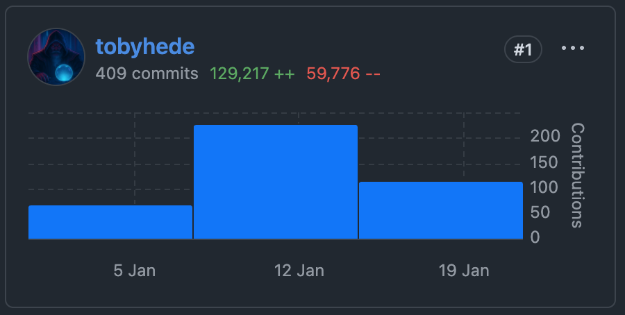

400 commits. 14 days. All achieved with human-in-the-loop agent orchestration, and without touching a single line of code.

I made a thing and you should check it out: [Rundown](https://rundown.cool/)

Rundown is my attempt to build a complete product in the Year of Our Claude, 2026.

Parser, state machine, policy-driven security model, WebContainers with a live CLI.
Open source, tested, packaged and released.

I think it could even be ok.



--

## Why?

Good question. The reaction of everyone I have shown Rundown to has been:

> Well done. Amazing. Um ... What is it?

So, as you may have heard, AI agents are powerful but fundamentally unpredictable. They skip steps. They improvise. They are distracted by the weight of their own context.

When your deployment runbook has 12 steps, you need all 12. Not 11. Not 13 because a rogue agent has discovered a "creative" alternative.

Exactly 12, in order.

There is a veritable CambrAIn explosion of orchestration tools, but they all seem to be:

- very opinionated
- very complex
- very confusing
- or a superposition of all of the above

I wanted something that would slot into **any** existing process with the most minimal ritual and configuration possible.

This is [Rundown](https://rundown.cool/).

Rundown transforms markdown documentation into interactive, stateful workflows that guide agents and enforce process.

1. Write simple Markdown to define steps, commands, and rules.
2. Use the Rundown CLI to execute the markdown, guiding agents step-by-step through the process.

````markdown
## 2. Run Tests
- FAIL: GOTO FixTest

Run the test suite to verify the implementation.

```bash
rd echo npm test
```
````

---


## What (do 400 commits get you)?

Quite a lot, actually.

I can safely say that working as the human-in-the-loop is at least an order of magnitude more productive than working alone.

A non-exhaustive list of the Rundown components includes:

- **Markdown parser** with custom syntax for executable steps and control flow
- **XState v5 state machine** for deterministic, inspectable workflow execution
- **Deno-inspired security model** with explicit policy enforcement (no "hallucinated permissions" here)
- **WebContainers integration** for in-browser demos and live CLI
- **MCP server** so other tools can talk to the CLI, not re-implement it
- **Claude Code plugin** because I have no self-preservation instinct
- **Playwright tests** for end-to-end CLI and WebContainer verification
- **CI pipeline** with automated quality gates
- **300+ tests** across 5 packages
- **Zod-powered schema validation** for all configuration and state transformations

---

## How?

I haven't typed a single line of code.

I haven't even looked at the code outside of code review.

Agents wrote the code. Other agents reviewed the code.

I **have** typed a lot of prompts.

My job was structure, architecture, and approach. The shape of the thing. I made decisions.

And I *attempted* to keep the machine on track, with mostly mixed results.

The core workflow remains
 - research (optional)
 - plan
 - refine plan
 - refine the plan more
 - implement
 - refine implementation

Research is optional, but incredibly valuable as a tool to help the human with enough domain knowledge to keep the machine in line.
TypeScript is not my thing - so I have spent quite a bit of time determining what good is meant to look like.

The process is front-loaded with detailed planning and refinement.
The more in the plan, the simpler implementation becomes.

My planning loop has become:
 - Claude Code `Plan` mode to iterate create a high-level plan
 - Create a detailed plan from the high-level plan
 - Multiple refinement loops between Claude and Codex
  - multiple agents, multiple models, multiple perspectives

Apart from the more formal upfront waterfall, the process really mirrors normal development:

1. Land a feature
2. Realise it's almost, but not quite, entirely unlike what is required
3. Iterate and refine

Is a very different type of development, but it is very productive, and it is incredibly addictive.


---


## So

I built Rundown with Claude Code and Codex and Gemini so I could orchestrate Claude Code and Codex and Gemini to build more ... other stuff.

The tool built the tool that improves the tool.

Welcome to software development in 2026.

--

Also you should check out [Rundown](https://rundown.cool/).

Claude Plugin coming soon!


